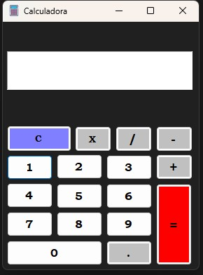

<h1 align="center"> Calculadora </h1>

Calculadora feita em C# e Windows Form

  <a href="#-tecnologias">Tecnologias</a>&nbsp;&nbsp;&nbsp;|&nbsp;&nbsp;&nbsp;
  <a href="#-projeto">Sobre</a>&nbsp;&nbsp;&nbsp;|&nbsp;&nbsp;&nbsp;
  <a href="#-tecnologias">Baixar</a>&nbsp;&nbsp;&nbsp;|&nbsp;&nbsp;&nbsp;

 

  

## 🚀 Tecnologias  

Este projeto foi feito com as seguintes tecnologias:

- C#
- Git e Github

## 🧮 Sobre

Essa calculadora faz o calculo de Soma, Subtração, Divisão e Multiplicação. 

## ⬇️ Baixar
Caso você tenha interesse de baixar a Calculadora. Entre no meu [Portfólio](https://CleoLeal.github.io/Portfolio) e clique no botão "Projects" que naquela página vai ter o botão para você baixar projeto.