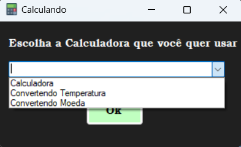
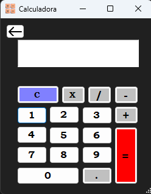
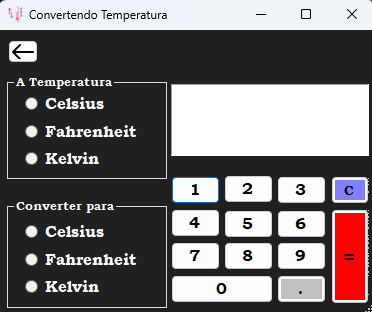
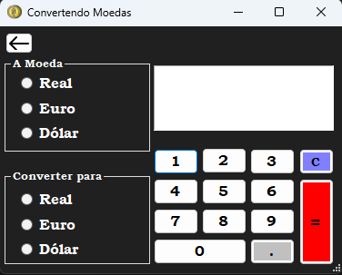

<h1 align="center"> Calculando </h1>

É um projeto feito em C# e Windows Form. No Calculando tem 3 projetos: Calculadora, Convertendo Temperatura e Convertendo 

  <a href="#-tecnologias">Tecnologias</a>&nbsp;&nbsp;&nbsp;|&nbsp;&nbsp;&nbsp;
  <a href="#-projeto">Sobre</a>&nbsp;&nbsp;&nbsp;|&nbsp;&nbsp;&nbsp;
  <a href="#-tecnologias">Baixar</a>&nbsp;&nbsp;&nbsp;|&nbsp;&nbsp;&nbsp;

 

## 🚀 Tecnologias  

Este projeto foi feito com as seguintes tecnologias:

- C#
- Git e Github

## 🧮 Sobre

Você faz a escolha de qual calculadora você gostaria de usar:

  

####  Calculadora
Na "Calculadora" você consegue fazer conta de Soma, Subtração, Multiplicação e Divisão. 

  

####  Convertedno Temperatura
No "Convertendo Temperatura" você consegue converter as Temperaturas mais usadas pelo mundo.

  

####  Convertendo Moeda
No "Convertendo Moeda" você consegue converter as Moedas mais conhecidas por nós Brasileiros.

  

## ⬇️ Baixar
Caso você tenha interesse de baixar o meu Projeto. Entre no meu [Portfólio](https://CleoLeal.github.io/Portfolio) e clique no botão "Projects" que naquela página vai ter o botão para você baixar projeto.